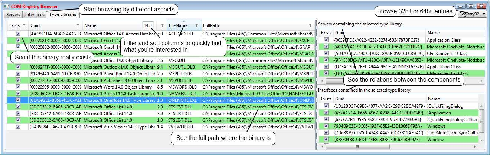

**Project Description**

This browser helps to get a quick overview of COM related registry entries and constraints, find orphans or mismatches and to ease cleanup of old stuff. 
Perfect for developers creating/using COM components to find out what is currently registered and if everything is consistent.

**History of this tool**

If you ever have developed COM components you probably will have stepped into the problem that suddenly something goes wrong and you have no clue what. Or even worse - on your developers machine everything is running fine, but on the customers not!

Usually you get some {"E_NOINTERFACE"} or {"E_CLASSNOTREGISTERED"} errors, and then start searching through the registry manually entry by entry. Now that’s the point where you’d love to have a tool that could give you a simple overview of what’s existing and what is linked to what – a COM Registry Browser – so that’s why I started the predecessor of this project a decade ago.

Even now in times of .Net there are lots of (legacy) COM components around that a developer has to deal with, so I decided to give my old 32bit native tool a face lift and port it to .Net/WPF, adding 64bit support and some other nice features.

**What this tool can help you with**

* Get an overview of what is registered and where; lots of errors can arise because parts of a project point to a temporary or outdated component.
* Show you if the expected components are registered in the correct location or point to non-existing files; e.g. a mix of debug and release components can cause the trouble.
* See the links between servers, interfaces and type libraries and if they are consistent.
* Shows you directly what server or type library is marshaling an interface.
* Let you easily find and cleanup orphan registry entries.

Support the Open Source Community.

